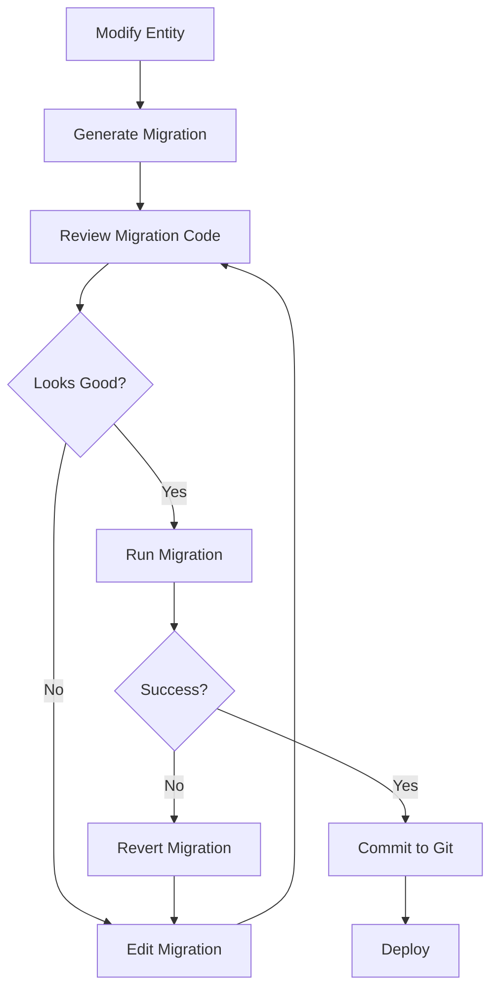

# Database Migration Guide

**Last Updated:** 2025-12-02  
**Database:** PostgreSQL  
**ORM:** TypeORM  

---

## 📋 Overview

This guide explains how to work with database migrations in the Dust & Glory project. We use TypeORM migrations to manage database schema changes in a version-controlled, reversible way.

---

## 🚀 Quick Start

### Initial Setup

1. **Install PostgreSQL** (if not already installed)
   - Download from [postgresql.org](https://www.postgresql.org/download/)
   - Recommended: PostgreSQL 14+

2. **Create Database**
   ```sql
   CREATE DATABASE dust_dev;
   ```

3. **Configure Environment**
   ```bash
   # Copy example env file
   cd backend
   copy .env.example .env
   
   # Edit .env with your PostgreSQL credentials
   DATABASE_TYPE=postgres
   DATABASE_HOST=localhost
   DATABASE_PORT=5432
   DATABASE_USERNAME=postgres
   DATABASE_PASSWORD=your_password
   DATABASE_NAME=dust_dev
   ```

4. **Run Initial Migration**
   ```bash
   npm run migration:run
   ```

5. **Seed Development Data** (optional)
   ```bash
   npm run seed
   ```

---

## 🔧 Available Commands

### Migration Commands

| Command | Description |
|---------|-------------|
| `npm run migration:generate src/migrations/MigrationName` | Generate migration from entity changes |
| `npm run migration:create src/migrations/MigrationName` | Create empty migration file |
| `npm run migration:run` | Run all pending migrations |
| `npm run migration:revert` | Rollback last migration |
| `npm run migration:show` | Show migration status |
| `npm run seed` | Seed development data |

---

## 📝 Common Workflows

### Workflow 1: Adding a New Column

**Scenario:** You want to add an `emailVerified` column to the User entity.

**Step 1:** Update the entity
```typescript
// backend/src/users/user.entity.ts
@Entity()
export class User {
  // ... existing fields
  
  @Column({ default: false })
  emailVerified: boolean;
}
```

**Step 2:** Generate migration
```bash
npm run migration:generate src/migrations/AddEmailVerifiedColumn
```

**Step 3:** Review the generated migration
```typescript
// backend/src/migrations/TIMESTAMP-AddEmailVerifiedColumn.ts
import { MigrationInterface, QueryRunner } from "typeorm";

export class AddEmailVerifiedColumn1234567890123 implements MigrationInterface {
    public async up(queryRunner: QueryRunner): Promise<void> {
        await queryRunner.query(`
            ALTER TABLE "user" 
            ADD "emailVerified" boolean NOT NULL DEFAULT false
        `);
    }

    public async down(queryRunner: QueryRunner): Promise<void> {
        await queryRunner.query(`
            ALTER TABLE "user" 
            DROP COLUMN "emailVerified"
        `);
    }
}
```

**Step 4:** Run the migration
```bash
npm run migration:run
```

**Step 5:** Verify in database
```sql
-- Connect to PostgreSQL
\d user

-- Should show the new emailVerified column
```

---

### Workflow 2: Creating a New Table

**Scenario:** You want to create a new `Notification` entity.

**Step 1:** Create the entity
```typescript
// backend/src/notifications/notification.entity.ts
import { Entity, PrimaryGeneratedColumn, Column, ManyToOne } from 'typeorm';
import { User } from '../users/user.entity';

@Entity()
export class Notification {
  @PrimaryGeneratedColumn('uuid')
  id: string;

  @ManyToOne(() => User)
  user: User;

  @Column()
  message: string;

  @Column({ default: false })
  read: boolean;

  @Column()
  createdAt: Date;
}
```

**Step 2:** Add entity to TypeORM config
```typescript
// backend/src/config/typeorm.config.ts
import { Notification } from '../notifications/notification.entity';

export const AppDataSource = new DataSource({
  // ... other config
  entities: [User, Character, InventoryItem, Quest, UserQuest, Notification],
});
```

**Step 3:** Also add to app.module.ts
```typescript
// backend/src/app.module.ts
TypeOrmModule.forRootAsync({
  // ... config
  entities: [User, Character, InventoryItem, Quest, UserQuest, Notification],
}),
```

**Step 4:** Generate migration
```bash
npm run migration:generate src/migrations/CreateNotificationTable
```

**Step 5:** Run migration
```bash
npm run migration:run
```

---

### Workflow 3: Rolling Back a Migration

**Scenario:** You made a mistake and need to undo the last migration.

**Step 1:** Check current migrations
```bash
npm run migration:show

# Output:
# [X] InitialSchema1764655650967
# [X] AddEmailVerifiedColumn1234567890123  <-- This one will be reverted
```

**Step 2:** Revert the last migration
```bash
npm run migration:revert
```

**Step 3:** Verify
```bash
npm run migration:show

# Output:
# [X] InitialSchema1764655650967
# [ ] AddEmailVerifiedColumn1234567890123  <-- Now pending
```

**Step 4:** Fix the migration file if needed
```typescript
// Edit src/migrations/TIMESTAMP-AddEmailVerifiedColumn.ts
// Make your corrections
```

**Step 5:** Re-run the corrected migration
```bash
npm run migration:run
```

---

## 🎯 Best Practices

### DO ✅

1. **Always generate migrations** - Don't manually write migrations unless necessary
2. **Review generated migrations** - TypeORM sometimes generates unnecessary changes
3. **Test migrations locally first** - Never run untested migrations in production
4. **Use descriptive names** - `AddUserEmailColumn` not `Migration1`
5. **Keep migrations small** - One logical change per migration
6. **Version control migrations** - Commit migration files to git
7. **Run migrations before starting app** - Ensure database is up to date

### DON'T ❌

1. **Don't modify executed migrations** - Create a new migration instead
2. **Don't use `synchronize: true` in production** - Always use migrations
3. **Don't skip migrations** - Run them in order
4. **Don't delete migrations** - They are part of your database history
5. **Don't commit broken migrations** - Test first!

---

## 🐛 Troubleshooting

### Problem: Migration fails with "relation already exists"

**Cause:** Entity already exists in database (possibly from old `sync hronize: true` setup)

**Solution:**
```bash
# Option 1: Drop and recreate database (DEV ONLY!)
DROP DATABASE dust_dev;
CREATE DATABASE dust_dev;
npm run migration:run

# Option 2: Manually drop the conflicting table
DROP TABLE IF EXISTS "table_name" CASCADE;
npm run migration:run
```

### Problem: "Cannot find module" error when running migrations

**Cause:** TypeScript compilation issue

**Solution:**
```bash
# Rebuild the project
npm run build

# Try migration again
npm run migration:run
```

### Problem: Migration partially executed and failed

**Cause:** Error in migration SQL

**Solution:**
```bash
# Manually clean up the partial migration in database
# Then fix the migration file and re-run

# Check migrations table
SELECT * FROM migrations;

# Delete the failed migration record if it exists
DELETE FROM migrations WHERE name = 'FailedMigration1234567890';

# Fix the migration file, then
npm run migration:run
```

### Problem: TypeORM generates unnecessary migrations

**Cause:** Entity definition doesn't match database exactly

**Solution:**
```typescript
// Common issues:

// 1. Case sensitivity
@Column({ name: 'userId' }) // Explicit column name

// 2. Type mismatches
@Column('varchar', { length: 255 }) // Be specific

// 3. Nullable fields
@Column({ nullable: true }) // Explicit nullable
```

---

## 📊 Migration Lifecycle



---

## 🔐 Production Deployment

### Pre-Deployment Checklist

- [ ] All migrations tested locally
- [ ] Database backup created
- [ ] Migrations run on staging environment
- [ ] No data loss expected
- [ ] Rollback plan prepared

### Running Migrations in Production

```bash
# 1. Backup database first!
pg_dump -U postgres -d dust_prod > backup_$(date +%Y%m%d_%H%M%S).sql

# 2. Run migrations
npm run migration:run

# 3. Verify application starts
npm run start:prod

# 4. If issues, rollback
npm run migration:revert
# Restore from backup if necessary
psql -U postgres -d dust_prod < backup_TIMESTAMP.sql
```

---

## 📚 Additional Resources

- [TypeORM Migrations Documentation](https://typeorm.io/migrations)
- [PostgreSQL Documentation](https://www.postgresql.org/docs/)
- [Project README](../README.md)

---

## 🆘 Getting Help

If you encounter issues:

1. Check this guide's Troubleshooting section
2. Review TypeORM documentation
3. Check project GitHub issues
4. Ask in team chat/discord

---

**Remember:** Migrations are a critical part of database management. Always test thoroughly before deploying to production!
